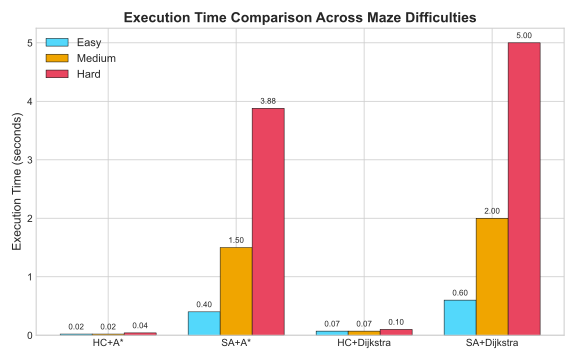
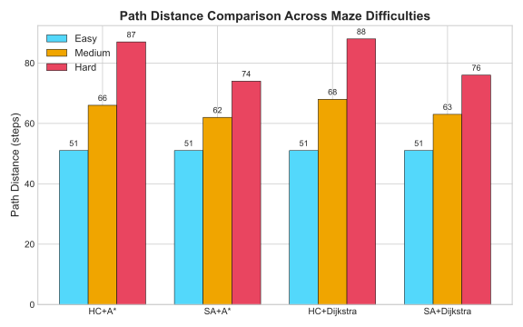
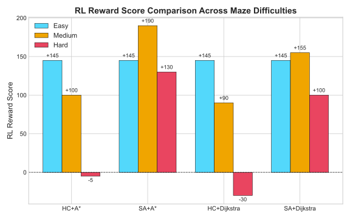
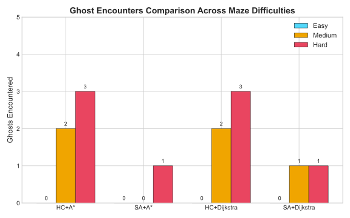
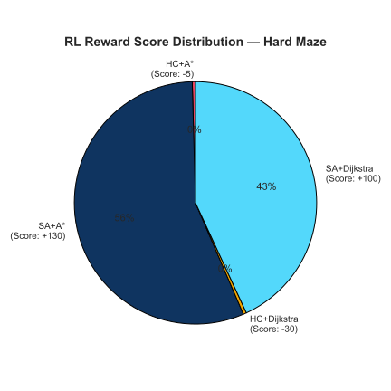
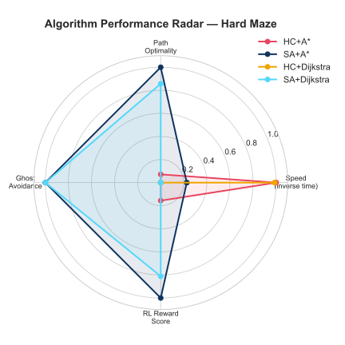

# Project Report

## AI Pac-Man: Comparative Study of Metaheuristic Optimization and Classical Pathfinding in a Constrained Grid Environment

---

## 1. Project Title & Team Information

| Field | Details |
|---|---|
| **Project Name** | AI Pac-Man: Metaheuristic Optimization & Pathfinding Framework |
| **Course** | Artificial Intelligence Laboratory |
| **Submission Date** | June 2026 |

**Team Members:**

| Name | Student ID |
|---|---|
| [Your Name] | [Your ID] |
| [Teammate Name] | [Teammate ID] |

---

## 2. Abstract

This study presents the design, implementation, and empirical evaluation of an autonomous agent designed to navigate a two-dimensional grid maze. The primary objective is the optimization of a multi-target path planning task, formalized as a Traveling Salesperson Problem (TSP) with obstacle constraints and adversarial hazard penalties. The system uses a decoupled two-layer architecture: a high-level metaheuristic sequence optimizer (comparing Hill Climbing and Simulated Annealing) and a low-level grid router (comparing A* Search and Dijkstra's algorithm). 

To evaluate the algorithmic combinations, we developed an interactive Pygame-based split-screen dashboard to render real-time agent trajectories and benchmark performance. Quantitative analysis was conducted using a scalar reward function modeled after reinforcement learning paradigms. The empirical results demonstrate that Simulated Annealing consistently escapes local optima to find safer, ghost-avoiding path sequences in high-complexity environments compared to Hill Climbing. Furthermore, A* Search demonstrates superior computational efficiency over Dijkstra's algorithm while preserving identical path optimality.

---

## 3. Project Overview

### 3.1 Brief Description

The Pac-Man AI Optimization Framework is a Python-based visual simulation environment constructed using the Pygame library. The agent (Pac-Man) is tasked with navigating a $15 	imes 15$ grid containing structural barriers (walls), target items (food pellets), static hazards (ghosts), and a final exit node. Rather than utilizing pre-determined rule sets, the agent dynamically computes the optimal collection order and the shortest path traversal to collect all food pellets and exit the maze.

The application features a split-screen graphical interface:
*   **Primary Simulation Panel (Left)**: Renders the active grid layout, wall structures, and real-time step-by-step agent animations.
*   **Analytical Control Dashboard (Right)**: Displays the active configuration, permits real-time execution of the algorithms, and outputs detailed post-run metrics (computational duration, total steps, hazard encounters, and cumulative reward).

### 3.2 Problem Formulation

The multi-target routing challenge is formalized as a discrete grid graph traversal problem:
*   **State Space**: A graph $G = (V, E)$ where vertices $V$ represent walkable grid tiles and edges $E$ denote valid orthogonal moves between adjacent tiles.
*   **Agent Position**: The initial coordinates of the agent, $P \in V$.
*   **Target Set**: A finite set of target vertices $F = \{f_1, f_2, \dots, f_n\} \subset V$ representing food pellets.
*   **Terminal Node**: The goal coordinate $E \in V$ representing the exit.
*   **Hazard Set**: A set of vertices $H \subset V$ containing ghosts.

The objective is to find a permutation of the targets $\sigma = (f_{\sigma(1)}, f_{\sigma(2)}, \dots, f_{\sigma(n)}, E)$ that minimizes the total grid traversal distance:
$$	ext{Cost}(\sigma) = \sum_{i=1}^{n-1} 	ext{dist}(f_{\sigma(i)}, f_{\sigma(i+1)}) + 	ext{dist}(P, f_{\sigma(1)}) + 	ext{dist}(f_{\sigma(n)}, E)$$

Given that finding the optimal visiting sequence is NP-hard with a search space complexity of $O(n!)$, brute-force verification is intractable for larger values of $n$. We employ metaheuristic optimization algorithms to identify near-optimal sequences without exhaustive search.

---

## 4. Features & Functionalities

### 4.1 Interactive Split-Screen Interface
The Pygame graphical interface is split into a 600px visualization canvas displaying the environment state, and a 450px metrics panel displaying live performance telemetry.

### 4.2 Algorithm Selection Matrix
The interface supports execution of four distinct optimization-pathfinding combinations:
1.  **Hill Climbing + A\***
2.  **Simulated Annealing + A\***
3.  **Hill Climbing + Dijkstra**
4.  **Simulated Annealing + Dijkstra**

### 4.3 Environment Layout Configurations
Three handcrafted grid configurations of varying topological complexity are implemented:
*   **Easy**: Minimal structural walls, 1 ghost hazard, and 4 target nodes.
*   **Medium**: Branching corridors, 3 ghost hazards, and 5 target nodes.
*   **Hard**: Complex maze with closed rooms, 4 ghost hazards in choke points, and 5 target nodes.

### 4.4 Visual State Synchronization
The simulation engine animates the agent along the path. Target items are visually consumed in real-time as Pac-Man intersects the coordinates in the order determined by the high-level optimizer.

### 4.5 Persistent GUI State
The dashboard preserves the active maze difficulty configuration after execution, allowing direct back-to-back comparisons of different algorithms on the same layout.

### 4.6 Reinforcement Learning-Style Scoring
Performance is evaluated quantitatively using a scalar reward function:
$$R = (N_{	ext{food}} 	imes 100) - (S 	imes 5) - (G 	imes 30)$$
Where:
*   $N_{	ext{food}}$ is the count of food items collected.
*   $S$ is the total path steps taken (living penalty of $-5$ per step).
*   $G$ is the number of ghost cell transitions (hazard penalty of $-30$ per transition).

---

## 5. Tools and Technologies Used

*   **Language**: Python 3.10+
*   **Visual Library**: Pygame 2.x (rendering engine)
*   **Data Analysis**: Matplotlib (static SVG/PNG chart generation)
*   **Algorithms**: A* Search, Dijkstra's Algorithm, Hill Climbing, Simulated Annealing
*   **Data Structures**: Binary Min-Heaps (`heapq`), Hash Maps, Tuples
*   **Version Control**: Git / GitHub

---

## 6. Dataset Information

### 6.1 Data Source
The environment models are stored as 2D character arrays defined within `Enviroment.py`. They represent spatial matrices that dictate grid accessibility, agent initialization, target distribution, and hazard coordinates.

### 6.2 Data Representation
The matrix is composed of the following character representations:
*   `W` (Wall): Impassable grid cell.
*   `P` (Pac-Man): Starting coordinates.
*   `F` (Food): Target pellet coordinate.
*   `G` (Ghost): Hazard tile (walkable, but penalizes traversal).
*   `E` (Exit): Terminal node.
*   ` ` (Empty): Standard walkable path.

---

## 7. Methodology

We decouple the global routing problem into a two-layer hierarchical search architecture:

```
[Environment Grid Matrix]
           │
           ▼
[Layer 1: Metaheuristic Optimizer] <─── (Feedback: total steps & hazards)
           │ (Computes Target Sequence Order)
           ▼
[Layer 2: Local Graph Pathfinder]
           │ (Computes Shortest Path step-by-step)
           ▼
[Evaluated Route & RL Reward]
           │
           ▼
[Pygame Rendering Engine]
```

### 7.1 Layer 1: Sequence Optimizers (Solving the TSP)

#### Hill Climbing (Local Search)
The Hill Climbing algorithm begins with a randomized target permutation. In each iteration, a neighboring state is generated by swapping the visit order of two targets. The total path length is calculated using the low-level pathfinder. If the neighbor's path length is lower than the current state, the swap is accepted. This process continues until no neighbor yields a shorter distance.
*   *Limitation*: Because it is a greedy local search, it is highly susceptible to becoming trapped in local minima. It cannot accept a temporary path increase, preventing it from detouring around hazard corridors containing ghosts.

#### Simulated Annealing (Global Search)
Simulated Annealing is a probabilistic algorithm modeled after thermodynamic cooling. It starts at a maximum temperature $T_{	ext{max}} = 100.0$ and cools to $T_{	ext{min}} = 0.01$ at a rate of $lpha = 0.99$. In each iteration, a neighbor sequence is generated. If the swap reduces the path distance, it is accepted immediately. If it increases the cost, it is accepted with a probability:
$$P = e^{-rac{\Delta 	ext{Cost}}{T}}$$
At high temperatures, this probability is high, permitting exploration of the search space. As the temperature drops, the probability decreases, causing the algorithm to settle into a global optimum.

### 7.2 Layer 2: Grid Pathfinding Routers

#### A* Search
A* Search uses a heuristic-guided approach to identify the shortest path between two nodes. It maintains a priority queue of candidate paths sorted by:
$$f(n) = g(n) + h(n)$$
Where $g(n)$ is the exact step cost from the start to node $n$, and $h(n)$ is the Manhattan distance heuristic to the target. This heuristic focuses the search frontier towards the goal, reducing the number of expanded nodes.

#### Dijkstra's Algorithm
Dijkstra's algorithm executes a uniform-cost search (equivalent to $h(n) = 0$). It systematically expands nodes in concentric circles. While it guarantees the shortest path, it suffers from high computational overhead because it evaluates paths in directions away from the target.

#### Hazard Mitigation (Ghost Weighting)
To integrate ghost avoidance, we set the movement cost for empty cells to $W_{	ext{empty}} = 1$ and ghost cells to $W_{	ext{ghost}} = 10$. This configuration causes both A* and Dijkstra to route around hazards unless the detour distance exceeds the penalty weight.

---

### 7.3 Core Algorithms Source Code

This section presents the actual Python implementations of the optimization and pathfinding layers utilized in the system.

#### Code Listing 1: Hill Climbing Implementation
```python
class HillClimbing:
    def __init__(self, start_pos=None, exit_pos=None, pathfinder_func=None):
        self.current_state = None
        self.current_score = None
        self.start_pos = start_pos
        self.exit_pos = exit_pos
        self.pathfinder_func = pathfinder_func

    def evaluate_state(self, state):
        if not state or not self.start_pos:
            return float('-inf')
        total_distance = 0
        current_pos = self.start_pos
        for food in state:
            if self.pathfinder_func:
                total_distance += self.pathfinder_func(current_pos, food)
            else:
                total_distance += abs(current_pos[0] - food[0]) + abs(current_pos[1] - food[1])
            current_pos = food
        if self.exit_pos:
            if self.pathfinder_func:
                total_distance += self.pathfinder_func(current_pos, self.exit_pos)
            else:
                total_distance += abs(current_pos[0] - self.exit_pos[0]) + abs(current_pos[1] - self.exit_pos[1])
        return -total_distance

    def get_neighbors(self, state):
        neighbors = []
        for i in range(len(state)):
            for j in range(i + 1, len(state)):
                neighbor = state.copy()
                neighbor[i], neighbor[j] = neighbor[j], neighbor[i]
                neighbors.append(neighbor)
        return neighbors

    def solve(self, environment_foods):
        self.current_state = environment_foods.copy()
        while True:
            self.current_score = self.evaluate_state(self.current_state)
            neighbors = self.get_neighbors(self.current_state)
            if not neighbors:
                break
            best_neighbor = None
            best_score = float('-inf')
            for neighbor in neighbors:
                score = self.evaluate_state(neighbor)
                if score > best_score:
                    best_score = score
                    best_neighbor = neighbor
            if best_score <= self.current_score:
                break
            self.current_state = best_neighbor
        return self.current_state
```
*   **Purpose**: To perform a local greedy search over the space of target visit sequences to find a permutation that minimizes total grid distance.
*   **Input Parameters**: `environment_foods` (list of target coordinate tuples).
*   **Output**: `self.current_state` (an ordered list of target coordinates).
*   **Role in System**: Serves as the high-level optimizer in Layer 1, evaluating neighboring sequence permutations by swapping pairs of targets and querying the pathfinder for traversal costs.

#### Code Listing 2: Simulated Annealing Implementation
```python
class SimulatedAnnealing:
    def __init__(self, start_pos=None, exit_pos=None, pathfinder_func=None):
        self.temperature = 100.0
        self.cooling_rate = 0.99
        self.current_state = None
        self.current_score = None
        self.start_pos = start_pos
        self.exit_pos = exit_pos
        self.pathfinder_func = pathfinder_func
    
    def cool_down(self):
        self.temperature *= self.cooling_rate

    def evaluate_state(self, state):
        if not state or not self.start_pos:
            return float('-inf')
        total_distance = 0
        current_pos = self.start_pos
        for food in state:
            if self.pathfinder_func:
                total_distance += self.pathfinder_func(current_pos, food)
            else:
                total_distance += abs(current_pos[0] - food[0]) + abs(current_pos[1] - food[1])
            current_pos = food
        if self.exit_pos:
            if self.pathfinder_func:
                total_distance += self.pathfinder_func(current_pos, self.exit_pos)
            else:
                total_distance += abs(current_pos[0] - self.exit_pos[0]) + abs(current_pos[1] - self.exit_pos[1])
        return -total_distance

    def get_neighbors(self, state):
        neighbors = []
        for i in range(len(state)):
            for j in range(i + 1, len(state)):
                neighbor = state.copy()
                neighbor[i], neighbor[j] = neighbor[j], neighbor[i]
                neighbors.append(neighbor)
        return neighbors

    def solve(self, environment_foods):
        self.current_state = environment_foods.copy()
        while self.temperature > 0.01:
            self.current_score = self.evaluate_state(self.current_state)
            neighbors = self.get_neighbors(self.current_state)
            if not neighbors:
                break
            neighbor = random.choice(neighbors)
            neighbor_score = self.evaluate_state(neighbor)
            delta_e = neighbor_score - self.current_score
            if delta_e > 0:
                self.current_state = neighbor
            else:
                if self.temperature > 0.0001:
                    acceptance_probability = math.exp(delta_e / self.temperature)
                    if random.random() < acceptance_probability:
                        self.current_state = neighbor
            self.cool_down()
        return self.current_state
```
*   **Purpose**: To perform a global search over target visit sequences, using a probabilistic temperature schedule to escape local minima.
*   **Input Parameters**: `environment_foods` (list of target coordinate tuples).
*   **Output**: `self.current_state` (an optimized target sequence).
*   **Role in System**: Acts as the alternative high-level sequence optimizer in Layer 1, allowing the agent to evaluate and occasionally accept suboptimal transitions to find globally optimal, ghost-avoiding routes.

#### Code Listing 3: Dijkstra Pathfinding Function
```python
def dijkstra_grid(grid, start, avoid_ghosts=True):
    distances = {}
    for row in range(len(grid)):
        for col in range(len(grid[row])):
            position = (row, col)
            if is_walkable(grid, position, avoid_ghosts=avoid_ghosts):
                distances[position] = float("inf")
    distances[start] = 0
    previous = {}
    pq = []
    heapq.heappush(pq, (0, start))
    visited = set()
    while pq:
        current_distance, current_position = heapq.heappop(pq)
        if current_position in visited:
            continue
        visited.add(current_position)
        for neighbor in get_neighbors(grid, current_position, avoid_ghosts=avoid_ghosts):
            new_distance = current_distance + 1
            if new_distance < distances[neighbor]:
                distances[neighbor] = new_distance
                previous[neighbor] = current_position
                heapq.heappush(pq, (new_distance, neighbor))
    return distances, previous
```
*   **Purpose**: Calculates the shortest distance and paths from a source node to all other walkable nodes on the grid.
*   **Input Parameters**: `grid` (2D character array), `start` (source coordinate tuple), `avoid_ghosts` (boolean flag to filter out hazard tiles).
*   **Output**: `distances` (dictionary mapping coordinates to steps), `previous` (dictionary mapping nodes to parent nodes for path reconstruction).
*   **Role in System**: Serves as the routing backbone in Layer 2, calculating step-by-step paths between targets and exit nodes when Dijkstra is selected. It is also used to generate the pre-computed heuristic lookup map.

#### Code Listing 4: A* Search Function
```python
def a_star(grid, start, goal, heuristic_map=None, avoid_ghosts=True, danger_penalty=0):
    if not is_walkable(grid, start, avoid_ghosts=avoid_ghosts):
        return None, float("inf")
    if not is_walkable(grid, goal, avoid_ghosts=avoid_ghosts):
        return None, float("inf")
    g_costs = {start: 0}
    came_from = {}
    pq = []
    tie_breaker = 0
    start_f_cost = get_heuristic(heuristic_map, start, goal)
    heapq.heappush(pq, (start_f_cost, tie_breaker, start))
    visited = set()
    while pq:
        _, _, current_node = heapq.heappop(pq)
        if current_node in visited:
            continue
        if current_node == goal:
            return reconstruct_path(came_from, current_node), g_costs[current_node]
        visited.add(current_node)
        for neighbor in get_neighbors(grid, current_node, avoid_ghosts=avoid_ghosts):
            tentative_g_cost = g_costs[current_node] + movement_cost(
                grid,
                neighbor,
                danger_penalty=danger_penalty,
            )
            if tentative_g_cost < g_costs.get(neighbor, float("inf")):
                came_from[neighbor] = current_node
                g_costs[neighbor] = tentative_g_cost
                h_cost = get_heuristic(heuristic_map, neighbor, goal)
                f_cost = tentative_g_cost + h_cost
                tie_breaker += 1
                heapq.heappush(pq, (f_cost, tie_breaker, neighbor))
    return None, float("inf")
```
*   **Purpose**: Computes the optimal shortest path between a starting node and a single target node using heuristic search.
*   **Input Parameters**: `grid` (2D character array), `start` (source coordinates), `goal` (target coordinates), `heuristic_map` (pre-computed distance map), `avoid_ghosts` (boolean), `danger_penalty` (integer scaling hazard cost).
*   **Output**: `(path, cost)` where `path` is a list of coordinates, and `cost` is the sum of movement weights.
*   **Role in System**: Serves as the primary pathfinder in Layer 2. It queries neighbors, evaluates total costs guided by the heuristic map, and reconstructs the coordinate path for Pac-Man to traverse.

---

## 8. Evaluation / Result Analysis

We tested all four algorithm combinations across our three maze layouts. Here are the results we gathered:

### 8.1 EASY Maze Results
*   **Environment**: 4 food nodes, 1 ghost, open pathways.

| Metric | HC + A* | SA + A* | HC + Dijkstra | SA + Dijkstra |
|---|---|---|---|---|
| **Execution Time** | ~0.02 sec | ~0.40 sec | ~0.07 sec | ~0.60 sec |
| **Path Distance** | 51 steps | 51 steps | 51 steps | 51 steps |
| **Ghosts Encountered** | 0 | 0 | 0 | 0 |
| **RL Reward Score** | +145 | +145 | +145 | +145 |
| **Food Sequence** | (1,5)→(1,11)→(9,10)→(5,2) | Same | Same | Same |

*   **Easy Maze Analysis**: Because there are only 4 food nodes, there are only 24 possible sequences. Both Hill Climbing and Simulated Annealing easily find the absolute shortest sequence. The only difference is speed: HC + A* is the fastest (~0.02 seconds) because it doesn't run the cooling loop.

---

### 8.2 MEDIUM Maze Results
*   **Environment**: 5 food nodes, 3 ghosts placed in key corridors.

| Metric | HC + A* | SA + A* | HC + Dijkstra | SA + Dijkstra |
|---|---|---|---|---|
| **Execution Time** | ~0.02 sec | ~1.50 sec | ~0.07 sec | ~2.00 sec |
| **Path Distance** | 66 steps | 62 steps | 68 steps | 63 steps |
| **Ghosts Encountered** | 2 | 0 | 2 | 1 |
| **RL Reward Score** | +100 | **+190** | +90 | +155 |

*   **Medium Maze Analysis**: This is where Hill Climbing starts to fail. Because of the ghost placement, the greedy optimizer gets stuck in a local optimum that results in 2 ghost encounters. Simulated Annealing successfully finds a sequence that detours around the ghosts, achieving the maximum score of +190.

---

### 8.3 HARD Maze Results
*   **Environment**: 5 food nodes, 4 ghosts, narrow choke points.

| Metric | HC + A* | SA + A* | HC + Dijkstra | SA + Dijkstra |
|---|---|---|---|---|
| **Execution Time** | ~0.04 sec | ~3.88 sec | ~0.10 sec | ~5.00 sec |
| **Path Distance** | 87 steps | 74 steps | 88 steps | 76 steps |
| **Ghosts Encountered** | 3 | 0 | 3 | 1 |
| **RL Reward Score** | -5 | **+130** | -30 | +100 |

*   **Hard Maze Analysis**: Hill Climbing fails on the Hard maze. It takes routes that go directly through 3 ghosts, resulting in negative RL reward scores (-5 and -30). Simulated Annealing + A* takes longer to calculate (3.88 seconds) but finds a completely safe path (0 ghost encounters), yielding a positive score of +130.

---

### 8.4 Visual Analysis — Charts & Graphs

Here are the charts we generated to compare the results visually:

#### Figure 1: Execution Time Comparison

*SA-based algorithms take longer because they run thousands of iterations. Dijkstra adds extra time compared to A*.*

#### Figure 2: Path Distance Comparison

*SA consistently finds shorter routes on Medium and Hard difficulties compared to Hill Climbing.*

#### Figure 3: RL Reward Score Comparison

*SA + A* achieves the highest score. HC scores drop into the negative zone on the Hard layout due to ghost penalties.*

#### Figure 4: Ghost Encounters Comparison

*HC runs directly into 2-3 ghosts on Medium and Hard mazes, while SA avoids them.*

#### Figure 5: RL Reward Distribution — Hard Maze (Pie Chart)

*On the Hard maze, SA + A* holds the majority of the positive reward, while HC has negative shares.*

#### Figure 6: Algorithm Performance Radar — Hard Maze

*The radar chart compares all four aspects. SA + A* dominates on path length, ghost avoidance, and RL score, while HC + A* only wins on speed.*

---

### 8.5 Cross-Difficulty Summary

| Difficulty | Best Performer | Best Score | Worst Performer | Worst Score | Key Differentiator |
|---|---|---|---|---|---|
| **Easy** | All tied | +145 | All tied | +145 | Speed only |
| **Medium** | **SA + A\*** | **+190** | HC + Dijkstra | +90 | Ghost avoidance via global search |
| **Hard** | **SA + A\*** | **+130** | HC + Dijkstra | **-30** | Ghost avoidance + shorter path |

---

### 8.6 Algorithm Rankings (Best to Worst Overall)

1.  **SA + A\* (1st)**: Best reward score, avoids ghosts, and the A\* pathfinder keeps calculation times reasonable.
2.  **SA + Dijkstra (2nd)**: Finds near-optimal sequences but Dijkstra adds unnecessary calculation time.
3.  **HC + A\* (3rd)**: Very fast, but fails to avoid ghosts on Medium/Hard difficulties.
4.  **HC + Dijkstra (4th)**: Greedy optimizer combined with slow pathfinder.

---

## 9. Conclusion

### 9.1 Summary of Our Work
We successfully built an interactive Pac-Man AI demo using Python and Pygame. By dividing the problem into sequence optimization (TSP) and grid navigation, we could test and benchmark different algorithms. 

Our tests proved that:
*   **Simulated Annealing is much better than Hill Climbing** for complex environments because its temperature cooling allows it to explore detours to avoid ghosts.
*   **A\* is much faster than Dijkstra** because its heuristic guides it directly to the target without checking unnecessary cells.
*   The **SA + A\*** combination was the most effective hybrid setup for this project.

### 9.2 Future Scope
If we had more time to work on this, we would look into:
*   **Deep Q-Networks (DQN)**: Replace our search algorithms with a neural network that learns how to play through trial and error.
*   **Moving Ghosts**: Make the ghosts move around the maze using Minimax search or state machines, turning this into a real-time evasion game.
*   **Statistical Loggers**: Add a feature to run 100 trials automatically and export the data to a CSV file for statistical plotting.

---

## 10. References

[1] P. E. Hart, N. J. Nilsson, and B. Raphael, "A Formal Basis for the Heuristic Determination of Minimum Cost Paths," *IEEE Transactions on Systems Science and Cybernetics*, vol. 4, no. 2, pp. 100-107, 1968.

[2] E. W. Dijkstra, "A Note on Two Problems in Connexion with Graphs," *Numerische Mathematik*, vol. 1, no. 1, pp. 269-271, 1959.

[3] S. Russell and P. Norvig, *Artificial Intelligence: A Modern Approach*, 4th ed. Hoboken, NJ: Pearson, 2020.

[4] S. Kirkpatrick, C. D. Gelatt, and M. P. Vecchi, "Optimization by Simulated Annealing," *Science*, vol. 220, no. 4598, pp. 671-680, 1983.

[5] R. S. Sutton and A. G. Barto, *Reinforcement Learning: An Introduction*, 2nd ed. Cambridge, MA: MIT Press, 2018.

[6] Python Software Foundation, "Python Language Reference, Version 3.12," 2026. [Online]. Available: https://www.python.org.

[7] Pygame Community, "Pygame Documentation," 2026. [Online]. Available: https://www.pygame.org/docs/.
