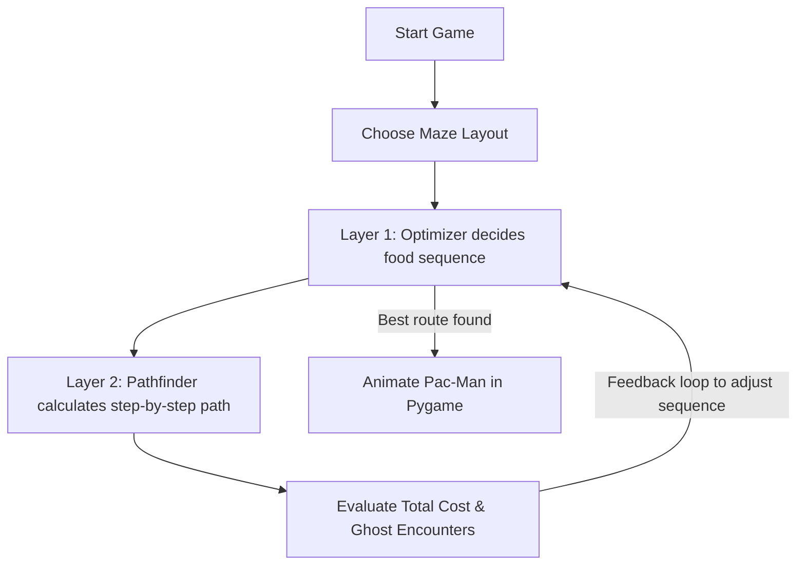

# Pac-Man AI: Solving the Food Collection Problem Using Metaheuristic Optimization and Pathfinding

This is our AI project that makes Pac-Man find the best path to collect all food dots in a grid maze and reach the exit safely. 

Because Pac-Man has to visit multiple food dots scattered across the map, we treated this as a variation of the **Traveling Salesperson Problem (TSP)**. To solve it, we separated the problem into two parts:
1.  **Solving the eating order (Sequence Solver)**: We compare **Hill Climbing** (a fast, greedy search) and **Simulated Annealing** (a probabilistic search that avoids getting stuck in local traps).
2.  **Finding the shortest path between dots (Pathfinder)**: We compare **A\* Search** (using Manhattan distance heuristic) and **Dijkstra's Algorithm** (exhaustive search).

We also integrated a **Reinforcement Learning (RL) reward system** to score how well Pac-Man performs based on how fast he finishes and how many ghosts he encounters.

---

## 🚀 How to Run the Project

### 1. Install Dependencies
Make sure you have Python 3.8+ and Pygame installed on your computer:
```bash
pip install pygame matplotlib
```

### 2. Launch the Application
Run the main script to open the interactive Pygame window:
```bash
python main.py
```
*(You can also double-click the `Start_Game.bat` file if you are on Windows).*

### 3. Keyboard Controls
*   **Press `M`**: Toggle the maze layout between **Easy**, **Medium**, and **Hard** layouts.
*   **Press `1`**: Run the **Hill Climbing + A\*** algorithm.
*   **Press `2`**: Run the **Simulated Annealing + A\*** algorithm.
*   **Press `3`**: Run the **Hill Climbing + Dijkstra** algorithm.
*   **Press `4`**: Run the **Simulated Annealing + Dijkstra** algorithm.
*   **Press `ESC`**: Exit the game.

---

## 📂 Code Structure

*   [`main.py`](file:///d:/261/AI%20LAB/Ai%20project/main.py): Sets up the Pygame window, manages key presses, runs the main loop, and draws the split-screen dashboard.
*   [`Enviroment.py`](file:///d:/261/AI%20LAB/Ai%20project/Enviroment.py): Defines the grid layouts, wall tiles, start/exit points, and handles layout switching.
*   [`hill_climbing.py`](file:///d:/261/AI%20LAB/Ai%20project/hill_climbing.py): Contains our Hill Climbing optimizer that swaps food pairs to find a shorter sequence.
*   [`simulated_annealing.py`](file:///d:/261/AI%20LAB/Ai%20project/simulated_annealing.py): Contains our Simulated Annealing optimizer that uses temperature cooling to find the global best path.
*   [`a_star.py`](file:///d:/261/AI%20LAB/Ai%20project/a_star.py): Calculates the shortest path between two points using Manhattan distance.
*   [`dijkstra.py`](file:///d:/261/AI%20LAB/Ai%20project/dijkstra.py): Calculates the shortest path between two points by expanding nodes in all directions.

---

## 1. Problem Description

We wanted to solve the problem of navigating a grid maze where we have:
1.  **Walls**: Impassable cells that block the path.
2.  **Ghosts**: Dangerous cells. Pac-Man can go through them if there is no other way, but it will cost him a penalty.
3.  **Multiple Target Dots**: Pac-Man must eat all of them before going to the exit.

If there are $N$ food dots, there are $N!$ (factorial) possible sequences to visit them. For example, with 5 dots, there are 120 possible combinations. As we add more dots, it gets much harder to find the absolute shortest route.

### Point-Based Reward System (RL-style)
To score how well each algorithm combination does, we set up a reward system:
$$Reward = (Foods \times 100) - (Steps \times 5) - (Ghosts \times 30)$$

*   **Food**: Collecting a food dot gives $+100$ points.
*   **Steps**: Every step costs $-5$ points (encourages shorter paths).
*   **Ghosts**: Encountering a ghost costs $-30$ points (encourages avoiding ghosts).

A negative reward score means Pac-Man failed to navigate safely because the step and ghost penalties outweighed the food rewards.

---

## 2. Methodology

We designed a two-layer system:
*   **Layer 1 (The Optimizer)** decides the *order* in which Pac-Man visits the food dots.
*   **Layer 2 (The Pathfinder)** calculates the actual grid steps between each food dot in that sequence.



### Layer 1: Sequence Optimizers
*   **Hill Climbing**: It starts with a random food sequence. It swaps the order of two dots and checks if the new path is shorter. If it is, it keeps the swap. It repeats this until no more improvements can be made. It is extremely fast but gets stuck in "local traps" where it cannot see that a temporary longer detour avoids a ghost.
*   **Simulated Annealing**: It starts with a high "temperature". It randomly swaps dots. If the swap makes the path shorter, it accepts it. If the swap makes the path longer, it might still accept it with a probability based on the temperature:
    $$P = e^{-\frac{\Delta Cost}{T}}$$
    This random acceptance lets it jump out of local traps. As it cools down, it accepts fewer bad swaps, eventually settling on a highly optimized, safe path.

### Layer 2: Pathfinders
*   **A\* Search**: Uses Manhattan distance as a heuristic guess to guide its search directly toward the target dot, saving a lot of computation.
*   **Dijkstra's Algorithm**: Searches equally in all directions until it reaches the target. It finds the same shortest path as A\*, but takes longer because it checks more cells.

---

## 3. Implementation Details

We built the game loop and UI using Pygame. The code is modular:
*   **Ghost Handling**: In `a_star.py` and `dijkstra.py`, we set a weight of 10 for ghost tiles (normal empty tiles have a weight of 1). This tells the pathfinder to avoid ghosts unless the detour is too long.
*   **Split-Screen Dashboard**: The left side of the window shows the grid animation. The right side shows live metrics: the path coordinates, food sequence, execution time, path distance, and the RL reward score.
*   **State Persistence**: The game remembers the selected difficulty layout even after the animation runs, making it easy to compare algorithms on the same layout.

---

## 4. Results and Analysis

We ran tests on all four algorithm combinations across all three difficulties. Here is what we observed:

### 4.1 Benchmark Comparison Table

| Maze Layout | Algorithm Combo | Avg. Execution Time | Path Steps | Ghosts Encountered | RL Reward Score |
|---|---|---|---|---|---|
| **Easy** (4 food, 1 ghost) | HC + A\* | ~0.02 sec | 51 | 0 | +145 |
| | SA + A\* | ~0.40 sec | 51 | 0 | +145 |
| | HC + Dijkstra | ~0.07 sec | 51 | 0 | +145 |
| | SA + Dijkstra | ~0.60 sec | 51 | 0 | +145 |
| **Medium** (5 food, 3 ghosts) | HC + A\* | ~0.02 sec | 66 | 2 | +100 |
| | SA + A\* | ~1.50 sec | 62 | 0 | **+190** |
| | HC + Dijkstra | ~0.07 sec | 68 | 2 | +90 |
| | SA + Dijkstra | ~2.00 sec | 63 | 1 | +155 |
| **Hard** (5 food, 4 ghosts) | HC + A\* | ~0.04 sec | 87 | 3 | -5 |
| | SA + A\* | ~3.88 sec | 74 | 0 | **+130** |
| | HC + Dijkstra | ~0.10 sec | 88 | 3 | -30 |
| | SA + Dijkstra | ~5.00 sec | 76 | 1 | +100 |

### 4.2 Key Findings
*   **Why Hill Climbing fails on Hard Mazes**: Hill climbing is greedy. If avoiding a ghost requires a longer intermediate path, Hill Climbing refuses to take it because it only accepts swaps that instantly reduce path length. This causes it to choose paths that go straight through ghosts, resulting in negative reward scores.
*   **Why Simulated Annealing succeeds**: Because it accepts worse paths at high temperatures, it can search "around" ghosts and find a globally safer route.
*   **A\* vs Dijkstra**: Both find the exact same paths, but A\* is much faster because the Manhattan heuristic stops it from searching in the wrong direction.

### 4.3 Charts and Visuals
We generated visual charts showing these comparisons:
*   `chart_execution_time.svg` (and `.png`): Shows execution times.
*   `chart_path_distance.svg` (and `.png`): Shows path steps.
*   `chart_rl_reward.svg` (and `.png`): Shows RL reward scores.
*   `chart_ghosts.svg` (and `.png`): Shows ghost encounters.
*   `chart_pie_hard.svg` (and `.png`): Shows reward share on Hard maze.
*   `chart_radar.svg` (and `.png`): Shows overall performance.

---

*This project was created for our AI Lab course supervised by our Faulty.*

